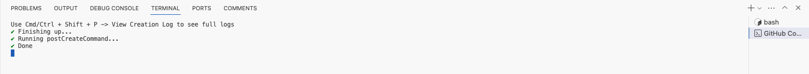
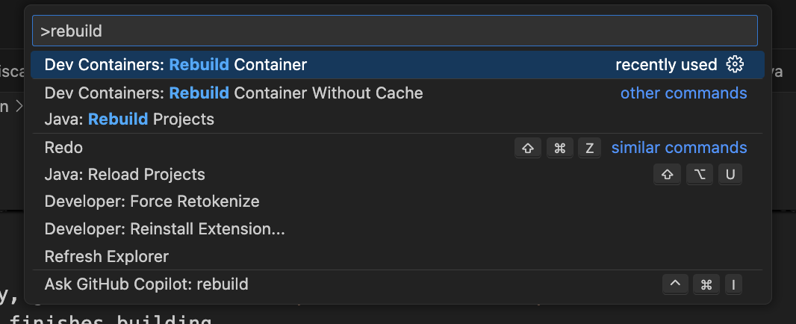
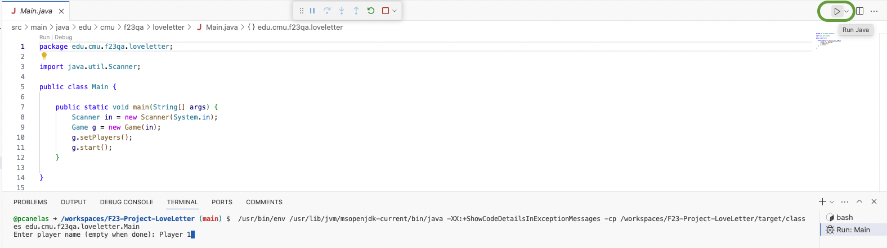

[](https://classroom.github.com/open-in-codespaces?assignment_repo_id=16728446)
# 17-623: Quality Assurance

This codebase will serve as the basis for the assignments and final project for the course, all of which will be group based (with the same groups throughout the course).


## Game: Love Letter


This repository provides a partial implementation of the popular board game, Love Letter.
Love Letter is a fast-paced card game in which players battle to “win the heart of the princess”.
The game consists of a series of rounds in which players win tokens of affection.
After acquiring a certain number of tokens, determined by the number of players in the game, that player immediately wins the game.

You can familiarize yourself with the basics of the game by watching the YouTube video below:

* [How to Play Love Letter in 3 Minutes - The Rules Girl](https://www.youtube.com/watch?v=WAiI7G3QdOU)

Once you have a rough idea of the rules, there are several free-to-play versions of the game online that you can play with members of your team:

* https://en.boardgamearena.com/gamepanel?game=loveletter
* https://netgames.io/games/love-letter

## Implementation

This project uses the following languages, tools, and frameworks:

* [Java 17.0.9](https://docs.oracle.com/en/java/javase/17)
* [Maven 3.9.9](https://maven.apache.org)
* [JUnit 5](https://junit.org/junit5)
* [Mockito](https://site.mockito.org) (v5.6.0)
* [EasyMock](https://easymock.org) (v5.2.0)


## Installation

### GitHub Codespaces

Since the game is played via a command-line interface, GitHub Codespaces is the easiest way to work with this project.
To get up and running:

1. In the current repository, go to `<> Code > Codespaces > Create codespace on main`.
2. Wait until the container finishes building.
3. After the Codespaces open, wait until you receive the message that the setup is Done and the terminal closes.
4. After the setup is done, **close the Terminal and open a new window to use any of the pre-installed tools**.



**Note: Do not forget to push your changes inside Codespaces so that your group partners can access them!**


### Dev Container via VS Code

**Before continuing with this step, you will need to install both VS Code and Docker to your machine.**

Clone your team's repository to your local development environment (e.g., your laptop).
Open the cloned project in [VS Code](https://code.visualstudio.com) and then hit `CMD + SHIFT + P` or `CTRL + SHIFT + P` to bring up the command palette in VS Code.
Type `Rebuild Container` into the dropdown and select `Dev Containers: Rebuild Container` from the list of options.
This will create a [Development Container](https://containers.dev) using the same instructions that are used by GitHub Codespaces (in the `.devcontainer` directory).




## Usage

### How to launch the game

In Visual Studio Code (VS Code), open the `Main.java` file and press the run button in the top right corner.
The application will launch and you can interact with it through the command-line.


### How to run the tests

Select the class you intend to test and press the run botton next to the class.
Optionally, if you want to execute a single test, you can press the run button next to the test case in the class.


You can also run all tests by running the following command in the command-line.

```
mvn clean compile test
```

### How to run additional checks via Maven

The out-of-the-box Maven configuration for the project (`pom.xml`) provides integration with several helpful QA tools that we expect you to use throughout the course.
Below is a brief description of each of those tools as well as instructions for invoking them from the command line:


* **[Checkstyle](https://github.com/checkstyle/checkstyle)** is a style checker for checking for adherence to coding standards for Java source code.
You can run Checkstyle via Maven with the following command:

  ```
  mvn checkstyle:check
  ```

* **[SpotBugs](https://spotbugs.readthedocs.io/en/stable)** is a pattern-based analysis tool for Java that examines source code syntax to identify “bug patterns” that correspond with common developer mistakes.
  SpotBugs is designed to help developers find bugs earlier in development and can be an effective tool in the context of continuous integration.
  You can run SpotBugs via Maven using the following command:

	```
  mvn spotbugs:check
  ```

* **[PMD](https://pmd.github.io)** is a multi-language, AST-based static analysis tool that finds common programming mistakes (e.g., unused variables, empty catch blocks, unnecessary object creation).
  It provides over 400 rules and can be extended with custom rules.
  You can run PMD via Maven with the following command:

  ```
  mvn pmd:check
  ```

* **[Checker Framework](https://checkerframework.org/manual)** integrates into the Java compiler to enhance Java’s type system with the ability to verify additional type information (e.g., nullness, initialization, taints, physical units) through the use of developer-provided source code annotations.
  For this assignment, you should enable the nullness checker, which can be used to identify potential null dereference bugs in your code (and, if the program is annotated correctly, guarantee that your code will not produce a null dereference).
  You can enable the nullness checker by uncommenting the “<annotationProcessors>” section of your pom.xml and by adding the appropriate `@NonNull` and `@Nullable` annotations to your code.

  Once you have enabled the nullness checker by modifying your `pom.xml`, it will run on every compilation attempt.
  In other words, you can run the nullness checker simply by running:

  ```
  mvn clean compile
  ```

### Test Coverage

- Jacoco
  - Whitebox Tests
  ```
  mvn clean compile
  mvn test -Dtest=Whitebox*Test
  mvn jacoco:report
  ```
  - Blackbox Tests
  ```
  mvn clean compile
  mvn test -Dtest=Blackbox*Test
  mvn jacoco:report
  ```
- PITest
  1. Modify pom.xml to select target tests (Whitebox or Blackbox)
  ```
  <!-- PITest -->
  ...
      <param>edu.cmu.f24qa.loveletter.actions.Blackbox*Test</param>
  ...
  ```
  2. Run PITest
  ```
  mvn clean compile test -DskipTests=false
  ```
